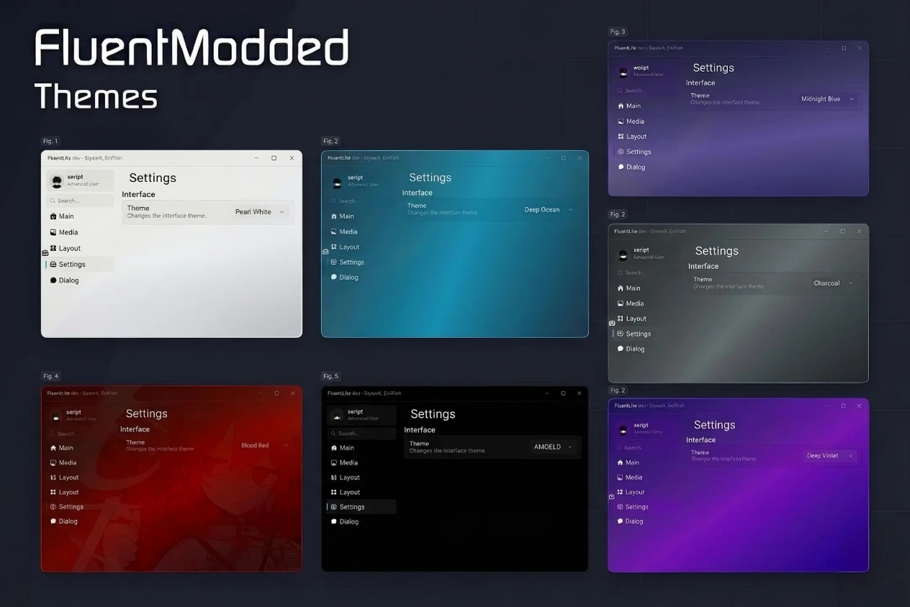

<p align="left">
  <a href="https://github.com/taithedev/Smoothfluentcloneee/graphs/contributors">
    
  </a>
  <a href="https://github.com/taithedev/Smoothfluentcloneee/issues">
    
  </a>
  <a href="https://github.com/taithedev/Smoothfluentcloneee/pulls">
    
  </a>
  <a href="https://github.com/taithedev/Smoothfluentcloneee/stargazers">
    
  </a>
  <a href="https://github.com/taithedev/Smoothfluentcloneee/network/members">
    
  </a>
  <a href="https://github.com/taithedev/Smoothfluentcloneee">
    
  </a>
  <a href="https://github.com/taithedev/Smoothfluentcloneee">
    
  </a>
</p>





# SmoothFluentCloneee

An improved Roblox Fluent-style UI library focused on smoother interactions, safer state handling, acrylic effects, extra themes, multi-pack icon support, and quality-of-life improvements.

> This project builds on the Fluent ecosystem and keeps the original project credits below. It is not affiliated with Roblox or the original Fluent authors.

---

## Build

Install the tools from `aftman.toml`, then run:

```bash
pnpm install
pnpm run check
```

The generated bundled library is written to `dist/main.lua`.

## License

MIT — [LICENSE](https://github.com/taithedev/Smoothfluentcloneee/blob/main/LICENSE)

---

## Credits
- [StyearX] - Main developer in this project
- [Vraigos/Fluent-Modded](https://github.com/Vraigos/Fluent-Moded) - original modded Version 
- [dawid-scripts/Fluent](https://github.com/dawid-scripts/Fluent) — original library
- [richie0866/remote-spy](https://github.com/richie0866/remote-spy) — UI assets and code
- [violin-suzutsuki/LinoriaLib](https://github.com/violin-suzutsuki/LinoriaLib) — element code, save manager
- [7kayoh/Acrylic](https://github.com/7kayoh/Acrylic) — Lua acrylic blur port
- [Latte Softworks & Kotera](https://discord.gg/rMMByr4qas) — bundler
